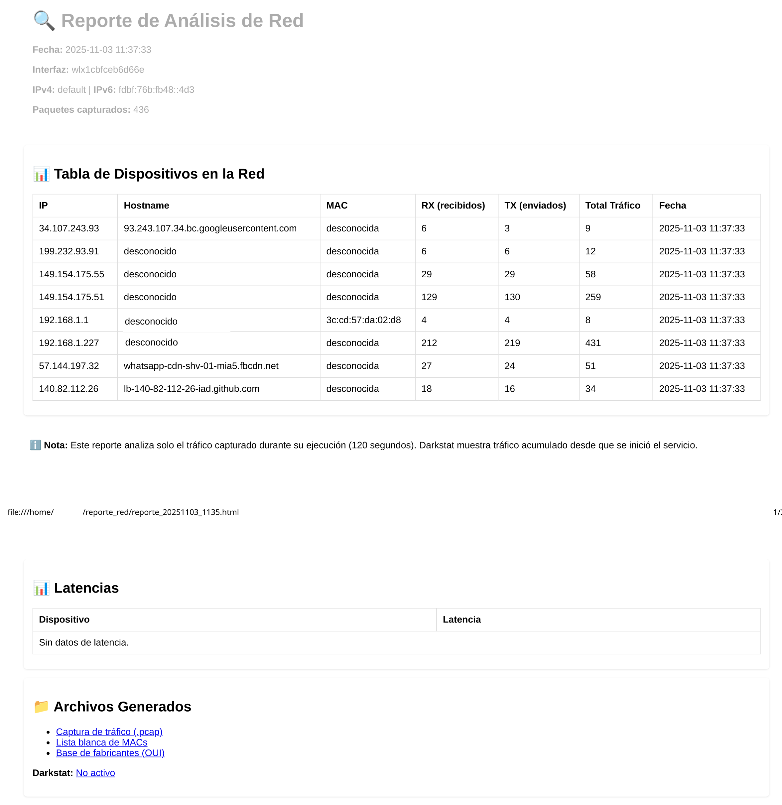

# 🕵️‍♂️ Análisis de Red para Debian

Script avanzado en Bash para diagnosticar redes locales en sistemas Debian/Ubuntu. Detecta:
- Alta latencia
- Direcciones MAC/IP duplicadas
- Tráfico sospechoso
- Storms de broadcast/multicast
- Dispositivos no autorizados

## 📊 Características

- Tabla detallada: **IP | Hostname | MAC | RX | TX | Total | Fecha**
- Reporte en **HTML y texto**
- Captura de tráfico en `.pcap`
- Integración con **darkstat**
- Lista blanca de MACs
- Soporte IPv4 e IPv6

## 🚀 Instalación

# Guía de instalación detallada

## 1. Dependencias

Ejecuta:

```bash
sudo apt update
sudo apt install -y nmap arp-scan iproute2 tcpdump tshark darkstat curl dnsutils
```

## 2. Permisos

El script debe ejecutarse con \`sudo\`:

```bash
sudo ./analisis_red_completo.sh
```

## 3. Configuración de darkstat (opcional)

Edita \`/etc/darkstat/init.cfg\` para ajustar la interfaz:

```ini
INTERFACE="-i eno1"
PORT="-p 667"
BINDIP="-b 0.0.0.0"
```

Luego reinicia:

```bash
sudo systemctl restart darkstat
```

## 4. Lista blanca de MACs
La primera vez que ejecutes el script, se creará en tu home la siguiente carpeta:

```bash
\`~/reporte_red/mac_whitelist.txt\`
```

Añade tus dispositivos confiables allí (una MAC por línea).

```bash
# Lista blanca de direcciones MAC (una por línea)
# Ejemplo:
# 00:11:22:33:44:55
```

## 5. Vista del reporte generado


